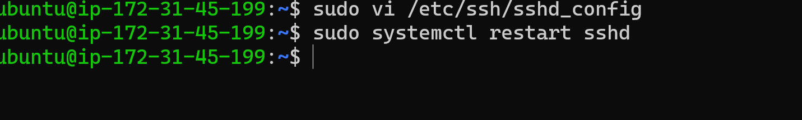
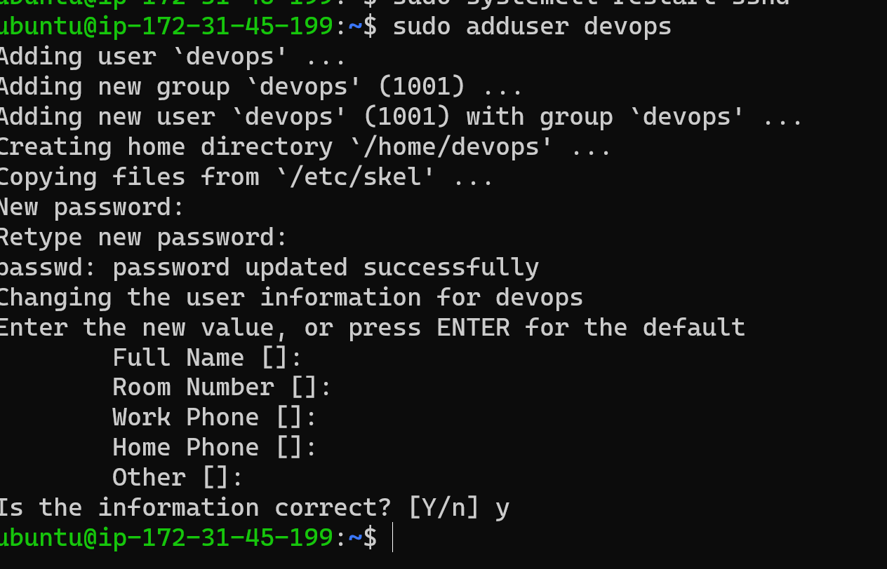
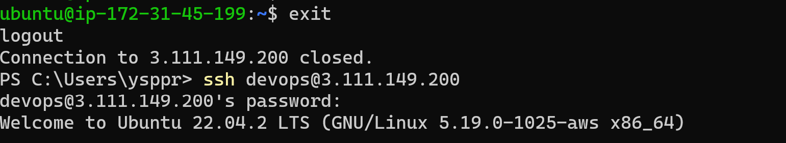

## INSTALLING NGINX,JAVA,DOTNET THROUGH ANSIBLE CONTROL NODE
---

### STEPS TO PERFORM
 1. Create two ubuntu vm's
 2. Enable the password authentication
 ```
 sudo vi etc/ssh/sshd-config
 ```
 

3. Restart the sshd
 
 

 4. Now create a user "devops" on both the instances

 

 5. Enable the sudo permissions to the users on both instances
 
 

 6. Now login with the devops user on both instances

 

 7. Now generate the keygen on the control node
 
 8. Now copy id of the control node to the node1 by giving the private ip address of node1

 


 ### Now we have connected both the machines

 9. To check the create a hosts file with node1 private ipaddress and run the command
 ```
  anisible -i hosts -m ping
  ```
  it will give some output which looks like this in below
  


### Now install ansible in the control node in devops user
 RUN THE COMMAND
 ```
 sudo apt update
sudo apt install software-properties-common -y
sudo add-apt-repository --yes --update ppa:ansible/ansible
sudo apt install ansible -y
```


## INSTALLING JAVA USING ANSIBLE
 
 1. Create two directory named inventory , playbooks
 2. In invetory create hosts file and give the node1 private ip address
 3. In the playbooks directory write a play installing java


 

 4. Now run the command 
 ```
 ansible-playbook -i <inventory_path> <playbook_path>
 ```
 5. Now we will see a output like this 
 
 

 NOW CHECK JAVA VERSION IN NODE1

 


 ## INSTALLING NGINX AND DOTNET
  1. In the playbooks directory write a play installing NGINX AND DOTNET
  2. Now run the command 
 ```
 ansible-playbook -i <inventory_path> <playbook_path>
 ```
 3. Now we will see a output like this

 

 ### NOW CHECK THE NODE1 TO SEE THE INSTALLATIONS

 

 


